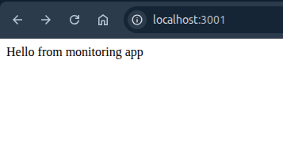
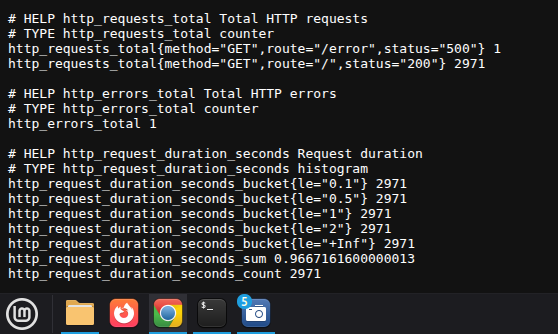
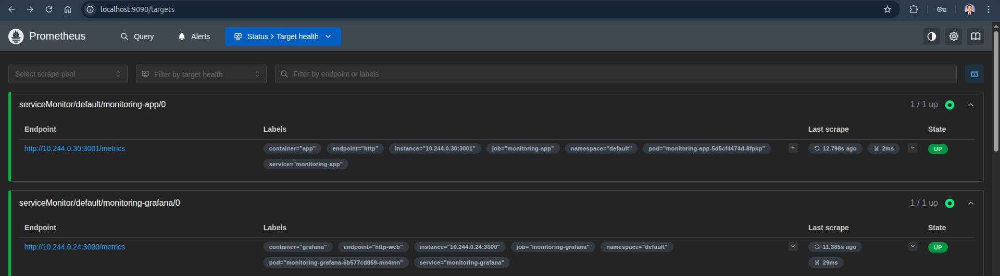
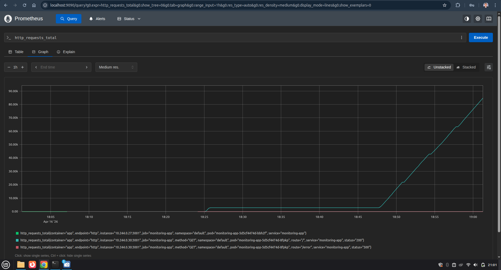
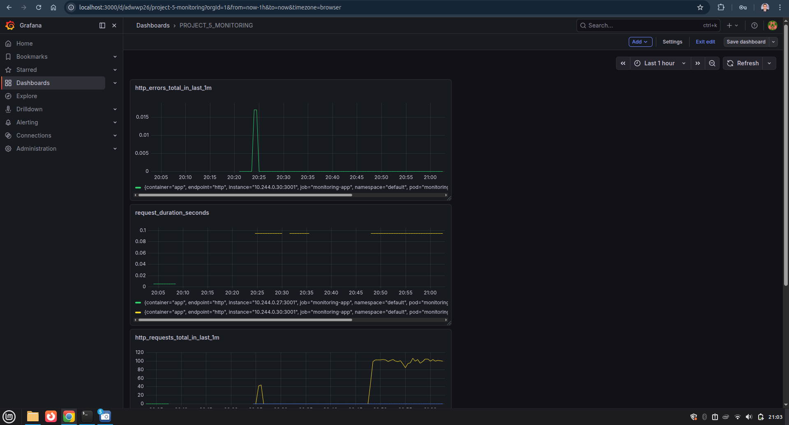
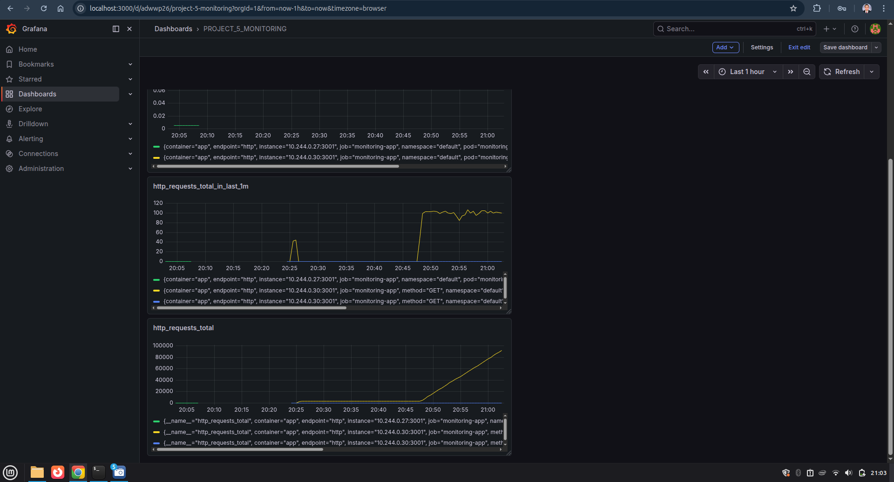
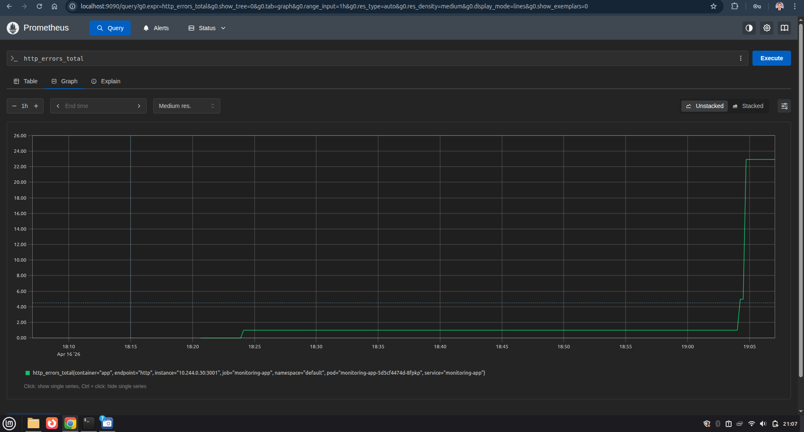
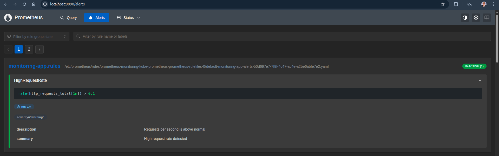
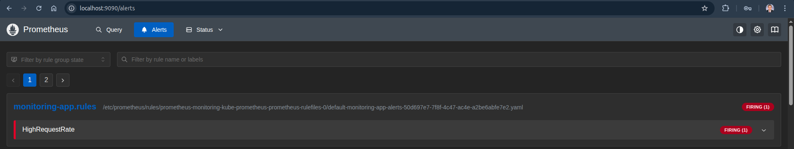

# DevOps Project 5: Kubernetes Monitoring with Prometheus & Grafana
**********************************************************************
This project demonstrates a complete end-to-end Kubernetes monitoring setup with Prometheus and Grafana,
including custom Node.js metrics, alerting rules, and real-time observability dashboards.

* The goal is to simulate a real-world observability setup with metrics, dashboards, and alerts.

## Architecture
******************
User ---> Node.js App (Pod) ---> Service ---> ServiceMonitor ---> Prometheus ---> Grafana / Alertmanager

## Technical Stack
*********************
- Node.js
- Docker
- Kubernetes
- Prometheus (kube-prometheus-stack via Helm)
- Grafana
- Alertmanager
- Prometheus Operator (ServiceMonitor)

## Features
**************

##### Application Metrics
- `http_requests_total` (with labels: method, route, status)
- `http_errors_total`
- `http_request_duration_seconds` (Histogram)

##### Monitoring
- Prometheus scrapes metrics using ServiceMonitor
- Metrics exposed via `/metrics` endpoint

##### Visualization (Grafana)
- Requests per second
- Total requests
- Error rate
- Request latency (P95)

##### Alerting
- High request rate alert:
PromQL --> `rate(http_requests_total[1m]) > 0.1`

## Key Queries
*****************

- Requests per second:
PromQL --> `rate(http_requests_total[1m])`

- Error rate:
PromQL --> `rate(http_errors_total[1m])`

- Latency (95th percentile):
PromQL --> `histogram_quantile(0.95, rate(http_request_duration_seconds_bucket[5m]))`

## Load Testing
******************

- Simulate traffic:
Bash --> `while true; do curl http://localhost:3001; done`

- Simulate errors:
Bash --> `while true; do curl http://localhost:3001/error; done`

## Screenshots
*****************
#### Application Running

#### Metrics Endpoint

#### Prometheus Targets

#### Http Requests Total

#### Grafana Dashboard
 

#### Error Simulation

#### Alerts

## What I Learned
********************
- How to use PromQL queries
- How Prometheus scrapes metrics using ServiceMonitor
- Difference between Counter and Histogram
- How to calculate latency percentiles (P95)
- How alerting works in Prometheus
- How Kubernetes labels connect components together (Pods, Services, and ServiceMonitors)

## Author
Ali Yasser
